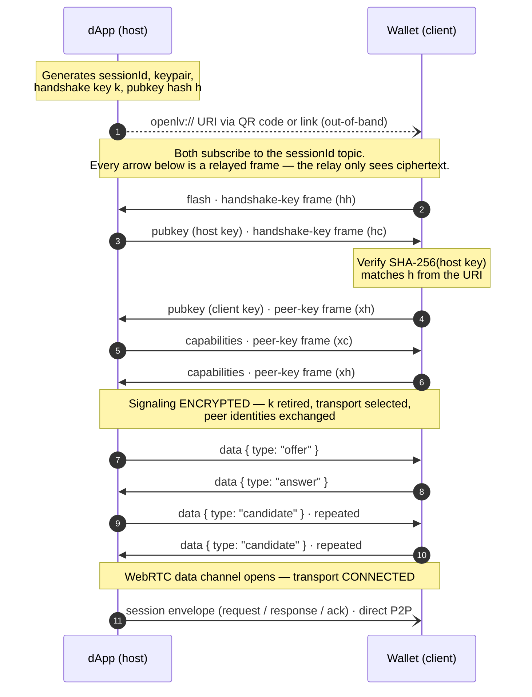
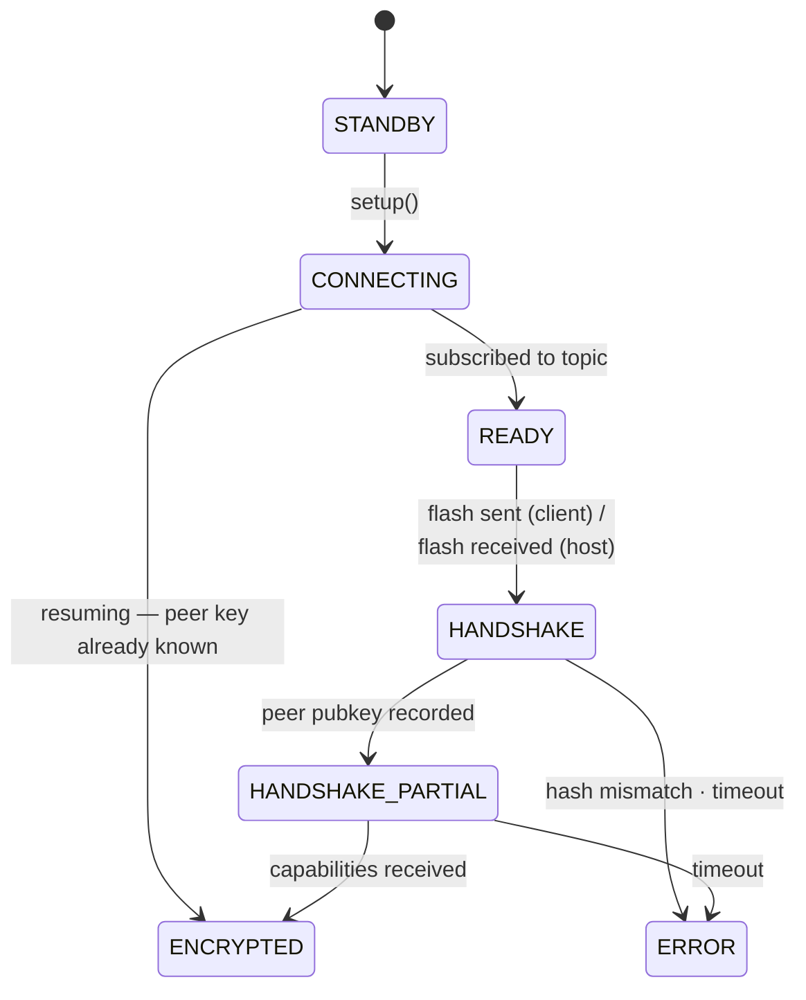

# Handshake Protocol

This page documents the wire protocol used to establish an openlv session: the signaling frame format, every packet exchanged during the handshake, the order they are sent in, and how transport negotiation happens afterwards.

The handshake runs over the [signaling](/api/signaling) layer on untrusted public infrastructure.
Everything the relay sees is ciphertext; the relay only learns timing, message sizes, and the session topic.

## Roles

| Role | Also called | Typical deployment |
|------|-------------|--------------------|
| **Host** | Advertising peer | The dApp — creates the session URI and shows the QR code |
| **Client** | Joining peer | The wallet — scans the URI and joins the session |

The roles are only asymmetric during the handshake. Once the transport is connected, both sides are equal peers.

## Frame format

Every signaling frame published to the relay is a single string:

```text
<prefix><recipient><ciphertext>
```

| Position | Values | Meaning |
|----------|--------|---------|
| `prefix` | `h` | Encrypted with the **handshake key** `k` from the session URI (AES-GCM) |
| | `x` | Encrypted to the **peer's public key** (X25519 + XSalsa20-Poly1305) |
| `recipient` | `h` | Intended for the host |
| | `c` | Intended for the client |
| `ciphertext` | base64 | The encrypted JSON packet |

So a frame starting with `hc` is a handshake-key encrypted message addressed to the client, and `xh` is a peer-key encrypted message addressed to the host.
Receivers silently drop frames not addressed to their role, frames that fail to decrypt, and decrypted payloads that don't match a known packet shape.

## Packets

Every decrypted payload is a JSON object with three fields:

```typescript
type SignalMessage = {
  type: "flash" | "pubkey" | "capabilities" | "data";
  payload: object | string | undefined;
  timestamp: number; // Unix ms at send time
};
```

### `flash`

Sent by the **client** to kick off the handshake, encrypted with the handshake key `k`.
The payload is an empty object — its only job is to tell the host "someone scanned the URI".

```json
{ "type": "flash", "payload": {}, "timestamp": 1750000000000 }
```

### `pubkey`

Carries a peer's encryption public key. Sent twice per handshake:

1. **Host → client** under the handshake key, in response to `flash`.
2. **Client → host** encrypted to the host's public key, after verifying it.

```json
{
  "type": "pubkey",
  "payload": { "publicKey": "<serialized X25519 public key>" },
  "timestamp": 1750000000000
}
```

The client verifies the host's key against the `h` parameter from the session URI (`SHA-256` of the serialized key, truncated to 16 hex chars).
A mismatch aborts the handshake — it means the relay (or another party on the topic) attempted to substitute a key.

### `capabilities`

Completes the handshake: it acknowledges the previous step, negotiates the transport, and shares peer metadata in a single packet. Sent twice:

1. **Host → client** once the host has recorded the client's key — this doubles as the delivery receipt for the client's `pubkey`.
2. **Client → host** to finish — this doubles as the delivery receipt for the host's `capabilities`.

It is only ever peer-key encrypted, so identity info is never exposed under the weaker handshake key, and neither side reveals anything about itself before the key exchange is complete.

```typescript
type SignalMessageCapabilities = {
  type: "capabilities";
  payload: {
    /** Supported transports, in preference order. */
    transports: ("wrtc" | "ws" | string)[];
    /** Optional self-description shown in the other peer's UI. */
    info?: {
      /** Reverse-DNS application identifier. */
      identity: string;   // "com.example.wallet"
      name: string;       // "Example Wallet"
      icon?: string;      // data URI or image URL — see below
    };
  };
  timestamp: number;
};
```

```json
{
  "type": "capabilities",
  "payload": {
    "transports": ["wrtc", "ws"],
    "info": {
      "identity": "com.example.wallet",
      "name": "Example Wallet",
      "icon": "data:image/png;base64,…"
    }
  },
  "timestamp": 1750000000000
}
```

Transport identifiers: `wrtc` ([WebRTC](/api/transport/webrtc)) and `ws` (relayed WebSocket, planned as a fallback for ICE-hostile networks).
Unknown identifiers are skipped, not fatal — a peer can advertise transports the other side has never heard of.

The `icon` may be a data URI or an image URL.
The wire only enforces its size (8 KB max — a receiver drops the whole packet beyond that, and a sender must refuse to send it); whoever renders or fetches the icon is responsible for sanity-checking it first, since it comes from the remote peer.
Some signaling protocols enforce small message limits (ntfy in particular), and the whole packet must survive base64 + encryption overhead — inline icons should be tiny (think 64×64 PNG), with a URL as the alternative for richer artwork.

#### Transport selection

Both `transports` lists are preference-ordered. The selected transport is the **first entry in the host's list that also appears in the client's list**.
Both sides compute this independently once they hold both packets — no extra confirmation round trip is needed.
An empty intersection fails the session with a "no common transport" error (signaling itself stays `ENCRYPTED`; the session disconnects).

### `data`

The only packet allowed after the handshake completes. Always peer-key encrypted.
Its payload is opaque to the signaling layer — it carries the [transport negotiation](#transport-negotiation) envelope for the selected transport.

```json
{ "type": "data", "payload": { "...": "..." }, "timestamp": 1750000000000 }
```

## Handshake sequence

The complete flow from URI creation to a connected peer-to-peer transport:



In packet order:

| # | Direction | Packet | Encryption | Purpose |
|---|-----------|--------|------------|---------|
| 1 | client → host | `flash` | handshake key | Announce presence |
| 2 | host → client | `pubkey` | handshake key | Share host public key |
| 3 | client → host | `pubkey` | host public key | Share client public key (after verifying `h`) |
| 4 | host → client | `capabilities` | client public key | Receipt for client key; offer transports + info |
| 5 | client → host | `capabilities` | host public key | Receipt for host capabilities; answer transports + info |
| 6+ | both | `data` | peer public key | Transport negotiation, then teardown of signaling |

## Delivery, retries, and state

Signaling relays are lossy (MQTT QoS 0, ntfy is best-effort), so each handshake step is **re-sent every 2 seconds** until the next inbound packet confirms it arrived, and receivers treat duplicates as no-ops.
The final packet has no successor to confirm it, so the rule inverts: if the client keeps receiving the host's `capabilities` after finishing, its own final packet was lost, and it answers each duplicate until the host goes quiet.
The whole handshake has a **30 second deadline**; if it isn't `ENCRYPTED` by then, signaling enters `ERROR` and the session reports a disconnect.



Two hardening rules worth knowing:

- A peer key is recorded **once** — a second, different `pubkey` mid-handshake is ignored as either a duplicate delivery or an injection attempt.
- The client enters `HANDSHAKE` *before* publishing `flash`, so the host's `pubkey` reply cannot race the publish.

## Transport negotiation

Once signaling is `ENCRYPTED`, the selected [transport](/api/transport) negotiates a direct connection by exchanging `data` packets. For WebRTC the payloads are:

```json
{ "type": "offer",     "payload": "<JSON-encoded SDP offer>" }
{ "type": "answer",    "payload": "<JSON-encoded SDP answer>" }
{ "type": "candidate", "payload": "<JSON-encoded ICE candidate>" }
```

The host creates the [WebRTC](/api/transport/webrtc) data channel and sends the `offer`; the client answers; both sides trickle ICE `candidate` messages until the channel opens.
From that point all application traffic flows over the direct transport using the session envelope:

```json
{ "type": "request",  "messageId": "<uuid>", "payload": { "method": "eth_requestAccounts", "params": [] } }
{ "type": "ack",      "messageId": "<uuid>" }
{ "type": "response", "messageId": "<uuid>", "payload": ["0x1234…"] }
```

The receiver acks a request immediately (so the sender knows the peer is alive while the user decides), then sends the correlated `response` when the handler resolves.
This session-envelope `ack` is a per-request receipt inside the established session — unrelated to the signaling handshake.
